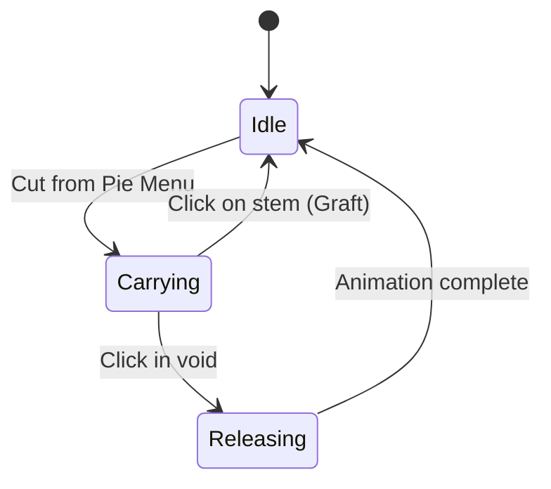

# Cut/Graft Mechanic MVP

Transform pruning from destructive to creative: cut subtrees follow the cursor, can be grafted elsewhere, or released to drift apart.

## Architecture

The mechanic involves three states:
1. **Cut**: Extract subtree from plant, attach to cursor
2. **Graft**: Attach carried subtree to another stem
3. **Release**: Let go in void, subtree drifts apart and fades



## Model Changes

Add to [src/model.ts](src/model.ts):

```typescript
// Subtree being carried by cursor
export type CarriedSubtree = {
  nodes: PlantNode[];         // All nodes in subtree
  adjacency: Map<Id, Id[]>;   // Subtree structure
  rootId: Id;                 // Root node of subtree
  sourceIslandPos: Vec2;      // Original island position (for rendering offsets)
};

// Subtree piece drifting after release
export type DriftingPiece = {
  id: Id;
  node: PlantNode;
  pos: Vec2;           // Current world position
  velocity: Vec2;      // Drift velocity
  opacity: number;     // Fading out
  age: number;         // Frames since release
};

// Add to World:
carriedSubtree: CarriedSubtree | null;
cursorWorldPos: Vec2;           // Track cursor in world coords
driftingPieces: DriftingPiece[]; // Released pieces fading out
```

## Implementation Steps

### 1. Model and Action Updates

**[src/core/actions/plant.ts](src/core/actions/plant.ts)**: Add `cutSubtree` function
- Similar to `pruneNode` but returns the extracted subtree instead of deleting it
- Reuse existing `collectDescendants` helper
- Export `findBestBranchAngle` for use in grafting

**[src/core/actions/plant.ts](src/core/actions/plant.ts)**: Add `graftSubtree` function
- Takes target stem node and carried subtree
- Uses `findBestBranchAngle` to pick attachment angle
- Remaps node IDs to avoid collisions with `genId`
- Merges subtree into target plant's adjacency

### 2. Update Dispatcher

**[src/update.ts](src/update.ts)**: Add new message types and handlers
- `{ type: "cut"; nodeId: Id }` - Extract subtree to cursor
- `{ type: "cursor/move"; worldPos: Vec2 }` - Track cursor position
- `{ type: "graft"; targetNodeId: Id }` - Attach carried subtree to stem
- `{ type: "release" }` - Drop subtree into void
- `{ type: "drift/tick" }` - Animate drifting pieces

### 3. UI Changes

**[src/ui/PieMenu.tsx](src/ui/PieMenu.tsx)**: Change "Trim" to "Cut"
- Same conditions (can't cut root)
- Dispatch `{ type: "cut" }` instead of `{ type: "trim" }`

**[src/App.tsx](src/App.tsx)**: Track cursor world position
- Add `onPointerMove` handler that dispatches cursor position
- Convert screen coords to world coords using camera transform

**[src/hooks/useCamera.ts](src/hooks/useCamera.ts)**: Handle clicks when carrying
- When `carriedSubtree` exists, clicking stem = graft, clicking void = release
- Prevent panning while carrying

### 4. Rendering

**[src/render/Garden.tsx](src/render/Garden.tsx)**: Render carried subtree and drifting pieces
- Carried subtree: render at cursor position with ghostly opacity (0.6)
- Drifting pieces: render each with fading opacity, drifting positions

**New component** or inline: `CarriedSubtreeRenderer`
- Reuses `PlantRenderer` logic but positioned at cursor
- Ghostly CSS filter: `opacity(0.7) saturate(0.5)`

### 5. Cursor Feedback

- When carrying: cursor changes to custom "carrying" style
- When hovering stem while carrying: show graft preview hint
- When clicking void: trigger release animation

## Key Code Locations

| Change | File |
|--------|------|
| CarriedSubtree type | [src/model.ts](src/model.ts) |
| cutSubtree, graftSubtree | [src/core/actions/plant.ts](src/core/actions/plant.ts) |
| New Msg types + handlers | [src/update.ts](src/update.ts) |
| PieMenu "Cut" action | [src/ui/PieMenu.tsx](src/ui/PieMenu.tsx) |
| Cursor tracking | [src/App.tsx](src/App.tsx), [src/hooks/useCamera.ts](src/hooks/useCamera.ts) |
| Render carried/drifting | [src/render/Garden.tsx](src/render/Garden.tsx) |