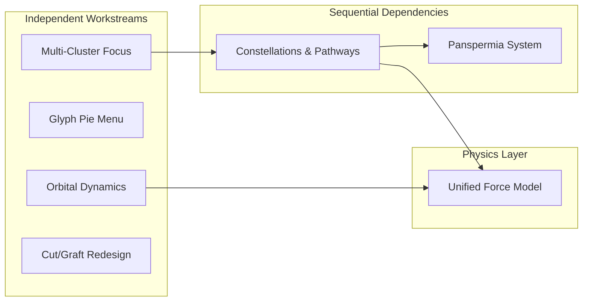

# Structured TODO Expansion Plan

I'll add the following new sections to [`docs/TODO.md`](docs/TODO.md), organized by domain. Each section will have:

- MVP tasks with concrete implementation steps
- Future/exploratory items with preserved conceptual context

---

## New Sections to Add to TODO.md

### 1. Orbital Dynamics & Cluster Physics

**MVP Tasks:**

- Islands slowly rotate/orbit around cluster glyphs
- Basic force model for orbital behavior (not exact radii — organic variance)

**Future/Conceptual (preserved detail):**

- Force setup resembling orbit but maintaining organic feel
- Push/pull options to adjust orbital radius (islands drift to new positions)
- Preserve natural inclination variance per island
- Eventually: 3D orbital paths with 2D rendering (islands/rocks move in 3D space but render as 2D)
- Depth fog for overlapping elements (slight differentiation without full 3D)

---

### 2. Glyph Pie Menu & Entity Interaction

**MVP Tasks:**

- Glyphs get their own pie menu (like plant stems do)
- Menu positioned tightly around glyph center (not outer circle)
- Visual indicator: circle around cluster when glyph selected

**Conceptual Vision:**

- Eventually every entity type should have a pie menu for interaction
- Glyph menu options affect whole cluster (orbit radius, binding tightness)

---

### 3. Multi-Cluster Focus & Selection

**MVP Tasks:**

- Ability to change focal cluster (currently only main cluster is un-blurred)
- Selected cluster should not be grayed/blurred out
- Other clusters remain foggy until selected

---

### 4. Constellations & Inter-Cluster Pathways

**MVP Tasks:**

- Faint lines of light between cluster glyphs
- Lines visible when zoomed out (constellation-like appearance)

**Future/Conceptual (preserved detail):**

- Constellations as higher-order construct (1 to ~12+ clusters per constellation)
- Multiple constellations possible
- Pathway forces: thin lines have pulling force
- Seeds/fireflies near pathways get pulled along
- Force direction: bidirectional vs unidirectional TBD
- Forms "tunnels" or travel corridors between clusters

---

### 5. Panspermia & Seed Lifecycle

**MVP Tasks:**

- **BUG**: Seeds don't seem to take root anymore — investigate and fix
- Seeds can travel between clusters via pathways
- Seeds root on arrival at new cluster islands

**Future/Conceptual (preserved detail):**

- Life begins in central cluster, spreads outward through pathways
- Prevent overcrowding: minimum distance from existing plant roots
- Nutrient/fertility model: islands have varying fertility levels
- Some areas overgrown, others sparse/bare (controlled randomness)
- Sparse/volcanic aesthetic: not everything covered in plants

---

### 6. Force & Physics Model (Unified)

**Future/Conceptual (preserved detail):**

- Different entities/nodes affected by different forces
- Plant segments: static positioning under glyph gravitation
- Particles: dynamic movement, affected by pathway pull
- Pathway force: pulls particles traveling between clusters
- Goal: integrated, consistent physics that looks/feels cool
- Not slavish to realism — prioritize aesthetic
- Rich parameter space to tune
- Forces affect both position (static) and movement (dynamic)

---

### 7. Cut/Graft Mechanic Redesign

**MVP Tasks:**

- Cut action: subtree attaches to cursor (carried, not deleted)
- Release in void: subtree floats like seed, drifts apart, fades out
- Graft to existing stem: attaches at smart angle (avoids overlap)

**Future/Exploratory:**

- Click rock to re-root the cut subtree (optional — depends on fit with system)
- Angle selection algorithm: minimize overlap with existing branches

---

## Changes to [`docs/TODO.md`](docs/TODO.md)

I'll add these as new backlog sections after the existing ones, with clear hierarchical structure:

```markdown
### Simulation Physics & Orbital Dynamics
_Dependency: None | Parallelizable: Yes_

(MVP + Future items...)

### Glyph Interaction & Entity Pie Menus  
_Dependency: None | Parallelizable: Yes_

(MVP + Future items...)

### Multi-Cluster Focus & Selection
_Dependency: None | Parallelizable: Yes_

(MVP items...)

### Constellations & Inter-Cluster Pathways
_Dependency: Multi-Cluster Focus | Parallelizable: Partially_

(MVP + Future items...)

### Panspermia & Seed Lifecycle
_Dependency: Pathways for inter-cluster travel | Parallelizable: Partially_

(BUG fix + MVP + Future items...)

### Cut/Graft Mechanic Redesign
_Dependency: None | Parallelizable: Yes_

(MVP + Future items...)
```

---

## Parallelization Notes

These new workstreams have the following dependency structure:



---

## What Gets Preserved

All conceptual details from your brain dump will be embedded as sub-bullets or notes under each TODO item:

- Organic vs mechanistic feel preferences
- 3D-in-2D rendering ideas
- Constellation scale (1-12+ clusters)  
- Sparse volcanic aesthetic goals
- Force model philosophy (aesthetic over realism)
- Panspermia narrative (life spreading from central cluster)